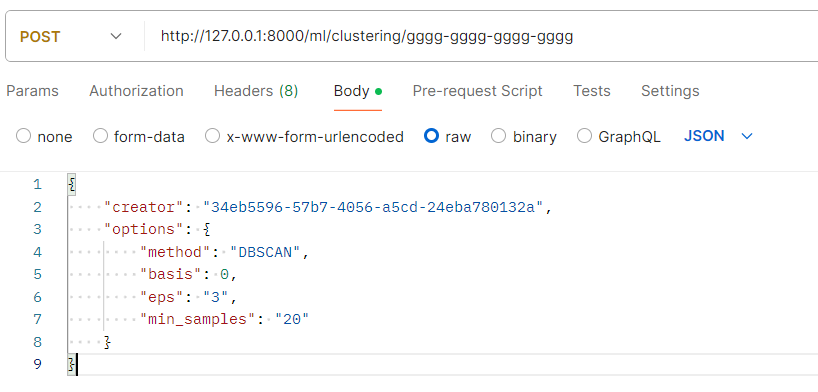
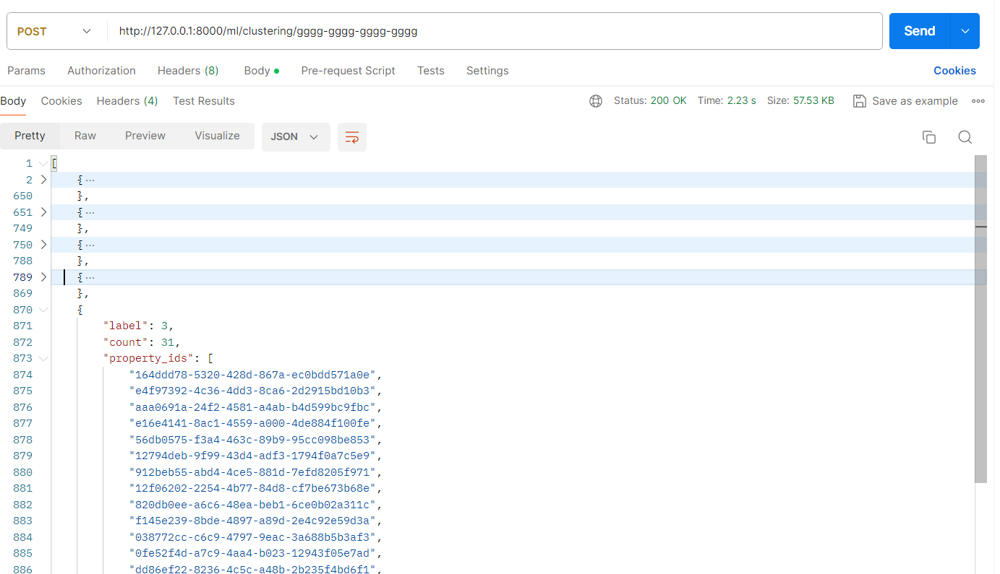

# fastapi_ML
基于 fastapi + sqlalchemy + asyncio 实现一个AI后端服务
功能包括:
- fastapi + pydantic 进行服务端的body映射
- sqlalchemy + asyncio 数据库异步服务
- docker 部署与打包

# 目录
- main.py: 入口
- config.py: 配置信息
- models: 数据结构
- core: 核心代码, 如数据处理、算法类
- routers: api接口
- utils: 工具类, 日志等

# 运行

1. clone代码
2. 安装环境
3. 运行fastapi
```shell
uvicorn app.main:app --reload
```

# 测试
1. 创建数据:
```shell
python scripts/mock_postgres.py
```

2. 发送请求:
```shell
curl --location 'http://127.0.0.1:8000/ml/clustering/0c46960f-f826-4cf8-b4a6-e58af47d631c' --header 'Content-Type: application/json' --data '{"creator": "34eb5596-57b7-4056-a5cd-24eba780132a","options": {"method": "DBSCAN","basis": 0,"eps": "3","min_samples": "20"}}'
```


3. 接收请求


# 使用docker部署
1. clone代码
2. build docker
```shell
docker build . -t app:<TAG>
```
3. modify docker-compose: <TAG>
4. modify example.env
5. copy example.env to .env
6. docker-compose up -d app --env-file .env
